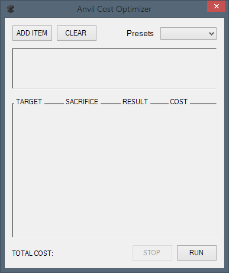

# AnvilCostOptimizer

Plays Minecraft. Learns about anvils.

Here's a small C# project I humored myself to finish writing after I discovered a [web app](https://aviettran.github.io/minecraft-anvil-calc/) that does practically the same thing.

